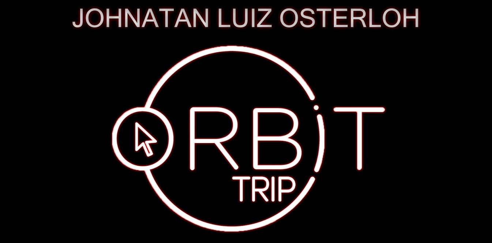

<h1 align="center">
    
    <br>
    API REST Spring-Boot
</h1>

<h4 align="center">
  API REST para cadastro e consulta de contatos.
</h4>

<p align="center">
  <a href="#technologies">Technologies</a>&nbsp;&nbsp;&nbsp;|&nbsp;&nbsp;&nbsp;
  <a href="#how-to-use">How To Use</a>&nbsp;&nbsp;&nbsp;|&nbsp;&nbsp;&nbsp;
</p>

## Technologies

Este projeto foi desenvolvido com a finalidade de capacitação pessoal, utilizando as seguintes tecnologias:

-  [Java 11](https://www.oracle.com/java/technologies/javase-jdk11-downloads.html)
-  [Gradle](https://gradle.org/)
-  [Spring Boot](https://spring.io/projects/spring-boot)
-  [Swagger](https://swagger.io/)
-  [Lombok](https://projectlombok.org/)
-  [PostgreSQL](https://www.postgresql.org/)
-  [Docker](https://www.docker.com/)
-  [IntelliJ IDEA](https://www.jetbrains.com/pt-br/idea/)
-  [Insomnia](https://insomnia.rest/download/)
-  [DBeaver](https://dbeaver.io/)

## How To Use

Para clonar e compilar este projeto, você precisará [Git](https://git-scm.com), 
[Java 11](https://www.oracle.com/java/technologies/javase-jdk11-downloads.html) ou superior instalado em seu 
computador:

```bash
# Clone this repository
$ git clone https://github.com/osterloh/agenda-contatos.git
```

---

Desenvolvido por [Johnatan Luiz Osterloh](https://www.linkedin.com/in/johnatanosterloh/)